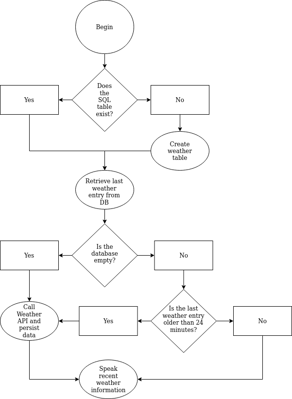
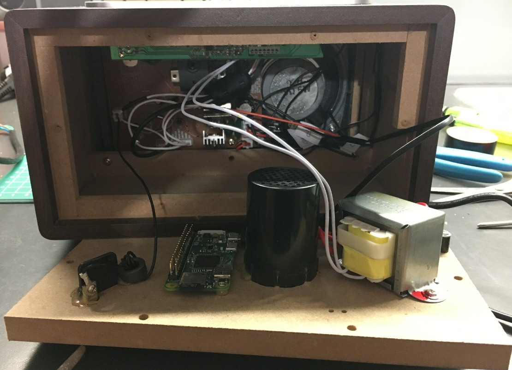

<h1>Radio Pi</h1>

<h3>Repository Contents</h3>

This repository contains Node script to download current weather information,
persist it using SQLite3 and speak it out loud using the audio output of a 
plain AM/FM radio.

<h3>Introduction</h3>

<i>Radio Pi</i> is a project that aims to add ability to speak text and generally add
arbitrary audio output to regular AM/FM radio. 

For this purpose I bought a very basic radio - Orava RR-29A.
The reason behind the choice of this machine is very simple - its design is meant 
to be "retro" and therefore the body is quite spacious and
made of plywood. Wooden material simplifies mounting hardware on the 
inside of the radio.
 
As power source for the Rpi I am using the mains, converted to 5 VDC by means of 
Hi-Link HLK-2M05 AC-DC converter.

<h3>Execution</h3>
<ul>
    <li>
        The Rpi audio output 
        (using regular GPIO PWM pins - <a 
        href="http://shallowsky.com/blog/hardware/pi-zero-audio.html">GUIDE HERE</a>)
        is soldered directly to the control board of the radio where the 3.5 mm audio jack
        input module is mounted to not to obstruct the audio input if needed.
    </li>
    <li>
        Speech synthesis is achieved using the "festival" program.
        (<a href="https://elinux.org/RPi_Text_to_Speech_(Speech_Synthesis)#Festival_Text_to_Speech">FESTIVAL INSTALLATION</a>)
    </li>
    <li>
        Weather information is obtained using <a href="https://openweathermap.org/api">OpenWeatherMap's</a> web API.
    </li>
    <li>
        Script execution is scheduled using Cron job.  ($ crontab -e)
    </li>
</ul>

<h3>UML diagram of the script</h3>

<h3>Installation Snapshot</h3>

